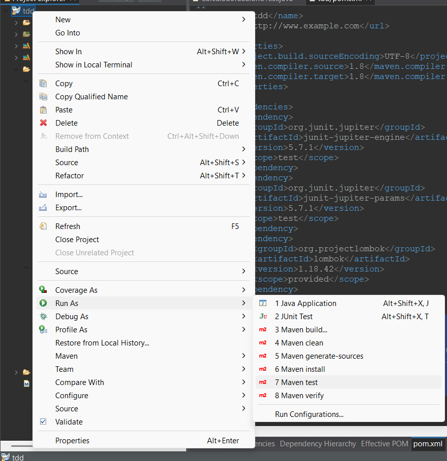

# Exercícios TDD com JUnit

Três exercícios desenvolvidos com **Test Driven Development (TDD)** utilizando **JUnit 5** e **Lombok**.  
Cada exercício aborda um cenário prático de desenvolvimento orientado a testes em Java.

---

## Estrutura do Projeto

src <br/>
├── main <br/>
│ └── java <br/>
│ └── com.exercicios.tdd <br/>
│ ├── Exerc1 → Lógica e testes de classificação de triângulos <br/>
│ ├── Exerc2 → Validação de objeto Person e Email (DAO) <br/>
│ └── Exerc3 → Calculadora de salário de funcionários <br/>
└── test <br/>
└── java <br/>
└── com.exercicios.tdd <br/>
├── TriangleTest.java <br/>
├── PersonDAOTest.java <br/>
└── CalculadoraSalarioTest.java <br/>

## Tecnologias Utilizadas

- **Java 8+**
- **JUnit 5 (Jupiter)** — framework de testes unitários  
- **Maven** — gerenciamento de build e dependências  
- **Lombok** — geração automática de getters, setters e construtores  

## Procedimento de Build

Antes de executar os testes, garanta que:

- O **Java JDK 8** ou superior está instalado;
- O **Maven** está configurado (`mvn -v` deve funcionar no terminal);
- O **Lombok** está habilitado na IDE:  
  - No IntelliJ: habilite *Annotation Processing*  
  - No Eclipse: verifique se o plugin está instalado.

---

## Compilar o Projeto

```bash
mvn clean compile
```

## Execução dos Testes
```bash
mvn test
```

### Ou, de maneira mais simples, clique em:

1. Botão direito na pasta do projeto  
2. **Run As**  
3. **Maven Test** <br/>



